Hey :wave:

I'm Jean-Charles, a software developer with 20 years of professional 
experience. I specialize in **functional programming** and **systems 
programming**, currently working mainly in **Haskell**, **Rust**, and **Nix**.

Check out my [website](https://jeancharles.quillet.org/) for articles and more, 
or my [CV](https://github.com/jecaro/cv/raw/master/jeancharles.quillet-en.pdf) 
for my full experience.

I maintain a few packages in 
[nixpkgs](https://github.com/search?q=repo%3ANixOS%2Fnixpkgs+maintainers+jecaro+language%3ANix&type=code).

## Rust

- [mprisqueeze](https://github.com/jecaro/mprisqueeze/): [MPRIS] interface for
  [squeezelite]. Uses D-Bus, HTTP, async.
  
- [mqttooth](https://github.com/jecaro/mqttooth/): MQTT to Bluetooth Low
  Energy bridge (Zigbee2MQTT -> BLE Environmental Sensing). Runs on Raspberry
  Pi.
  
- [advent-of-code-2023](https://github.com/jecaro/advent-of-code-2023): My 
  solutions to the Advent of Code 2023.

## Haskell

- [diverk](https://github.com/jecaro/diverk/): Android app to browse GitHub
  repositories, built with Reflex (FRP).
- [htagcli](https://github.com/jecaro/htagcli): Command line audio tagger and
  music organizer.
- [systranything](https://github.com/jecaro/systranything): Put anything in
  your system tray from a YAML file.
  
- [hscalendar](https://github.com/jecaro/hscalendar): Time tracking webapp,
  Haskell backend + Elm frontend, deployed with Docker.
- [bigball](https://github.com/jecaro/bigball): Dependency graph for Visual
  Studio solution files.
- [minihasklisp](https://github.com/jecaro/minihasklisp): Minimalist Lisp
  interpreter.
- [wolfram](https://github.com/jecaro/wolfram): Elementary cellular automaton.
- [reflex-tutorial](https://github.com/jecaro/reflex-tutorial): The official 
  [tutorial](https://reflex-frp.org/tutorial) for 
  [reflex](https://reflex-frp.org/) along a few other interesting examples.

## Neovim plugins

- [ghcid-error-file.nvim](https://github.com/jecaro/ghcid-error-file.nvim): 
  Fast feedback loop with [ghcid] or [ghciwatch].
- [fugitive-difftool.nvim](https://github.com/jecaro/fugitive-difftool.nvim): 
  Diff branches in [neovim] with [fugitive].

## Other projects

- [circuix-sword](https://github.com/jecaro/circuix-sword/): NixOS in a
  Gameboy shell. DIY retro handheld based on a Raspberry Pi CM3.
- [pomodozig](https://github.com/jecaro/pomodozig): Terminal pomodoro timer in
  Zig.
- [your-hand-in-mine](https://github.com/jecaro/your-hand-in-mine): Piano
  transcription of an Explosions in the Sky adaptation.

[nixpkgs packages]: 
https://github.com/search?q=repo%3ANixOS%2Fnixpkgs+maintainers+jecaro+language%3ANix&type=code
[MPRIS]: https://specifications.freedesktop.org/mpris-spec/latest/
[fugitive]: https://github.com/tpope/vim-fugitive
[ghcid]: https://github.com/ndmitchell/ghcid
[ghciwatch]: https://github.com/MercuryTechnologies/ghciwatch
[squeezelite]: https://github.com/ralph-irving/squeezelite
